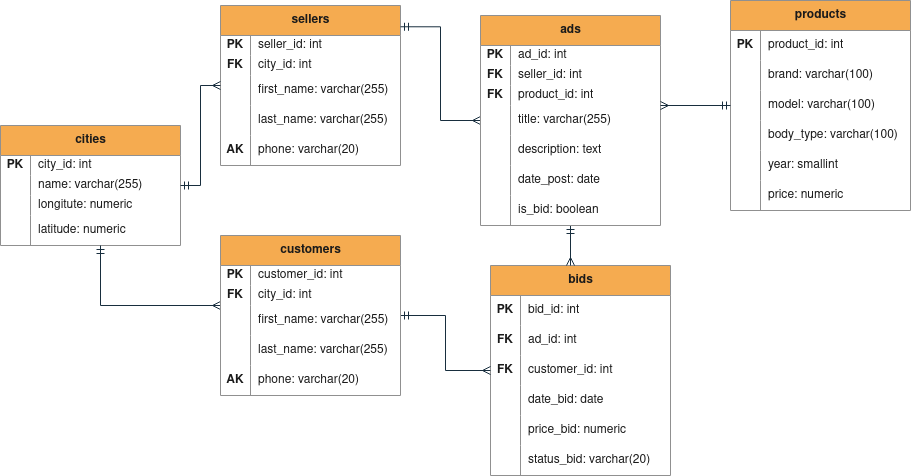

## 1. Mission Statement
- Menjadi wadah pertemuan antara penjual dan pembeli mobil 
- Mempermudah pembeli memilih mobil sesuai dengan iklan yang tersedia
- Mempermudah mengelola penawaran mobil dari pembeli

## 2. Creating Table Structures
| Nama Tabel | Deskripsi |
|:-|:-|
| cities | Menyimpan informasi batasan kota-kota yang tersedia |
| sellers | Menyimpan informasi tentang data diri seller |
| customers | Menyimpan informasi tentang data customer |
| products | Menyimpan informasi tentang product (mobil) yang dijual oleh seller |
| ads | Menyimpan informasi iklan tentang product yang dijual |
| bids | Menyimpan informasi penawaran harga yang dilakukan customers |

### 2.1 Creating Field Name and Data Type
#### Table: cities
| Field: Data Type | Keterangan | Key |
|:-|:-|:-|
| city_id: int | Menyimpan informasi id kota | **PK** |
| name: varchar(255) | Menyimpan informasi nama kota |
| longitude: numeric | Menyimpan informasi kordinat garis bujur |
| latitude: numeric | Menyimpan informasi kordinat garis lintang |

#### Table: sellers
| Field: Data Type | Keterangan | Key |
|:-|:-|:-|
| seller_id: int | Menyimpan informasi id seller | **PK** |
| city_id: int | Menyimpan informasi id kota | **FK** |
| first_name: varchar(255) | Menyimpan informasi nama depan seller |
| last_name: varchar(255) | Menyimpan informasi nama belakang seller |
| phone: varchar(20) | Menyimpan informasi phone number seller | **AK** |

#### Table: customers
| Field: Data Type | Keterangan | Key |
|:-|:-|:-|
| customer_id: int | Menyimpan informasi id customer | **PK** |
| city_id: int | Menyimpan informasi id kota | **FK**|
| first_name: varchar(255) | Menyimpan informasi nama depan customer |
| last_name: varchar(255) | Menyimpan informasi nama belakang customer |
| phone: varchar(20) | Menyimpan informasi phone number customer | **AK** |

#### Table: products
| Field: Data Type | Keterangan | Key |
|:-|:-|:-|
| product_id: int | Menyimpan informasi id mobil | **PK** |
| brand: varchar(100) | Menyimpan informasi merek mobil |
| model: varchar(100) | Menyimpan informasi model mobil |
| body_type: varchar(100) | Menyimpan informasi jenis body mobil |
| year: smallint | Menyimpan informasi tahun keluaran mobil |
| price: numeric | Menyimpan informasi harga mobil |

#### Table: ads
| Field: Data Type | Keterangan | Key |
|:-|:-|:-|
| ad_id: int | Menyimpan informasi id iklan | **PK** |
| seller_id: int | Menyimpan informasi id seller | **FK** |
| product_id: int | Menyimpan informasi id product | **FK** |
| title: varchar(255) | Menyimpan informasi judul iklan | 
| description: text | Menyimpan deskripsi tambahan tentang product |
| date_post: date | Menyimpan informasi postingan iklan |
| is_bid: boolean | Menyimpan infromasi apakah mobil bisa ditawar | 

#### Table: bids
| Field: Data Type | Keterangan | Key |
|:-|:-|:-|
| bid_id: int | Menyimpan informasi id bid | **PK** |
| ad_id: int | Menyimpan informasi id iklan | **FK** |
| customer_id: int | Menyimpan informasi id customer | **FK** |
| date_bid: date | Menyimpan informasi tanggal bid |
| price_bid: numeric | Menyimpan informasi penawaran harga |
| status_bid: varchar(20) | Menyimpan informasi status bid |

## 3. Determine Table Relationships
### 3.1 Identifying Relationship
|  |cities | sellers | customers | products | ads | bids |
|-|:-|:-:|:-:|:-:|:-:|:-:|
| **cities** |  | 1:N | 1:N |  |  |  |
| **sellers** |  |  |  |  | 1:N |  |
| **customers** |  |  |  |  |  | 1:N |
| **products** |  |  |  |  | 1:N |  |
| **ads** |  |  |  |  |  | 1:N |
| **bids**|  |  |  |  |  |  |

### 3.2 Entity Relationship Diagram

##  4. Determine Business Rules
### Table: cities
#### Business Rules
- Primary key **tidak** bersifat auto increment
- Informasi pada table cities harus lengkap

#### Constraint
- **NOT NULL** pada field:
 - name: varchar(255)
 - longitute: numeric
 - latitude: numeric
  
### Table: sellers
#### Business Rules
- Primary key bersifat auto increment
- Informasi pada table sellers harus lengkap

#### Constraint
- seller_id: int generated by default as identity
- **NOT NULL** pada field:
    - city_id: int
    - first_name: varchar(255)
    - last_name: varchar(255)
    - phone: varchar(20)

### Table: customers
#### Business Rules
- Primary key bersifat auto increment
- Informasi pada table customers harus lengkap

#### Constraint
- customer_id: int generated by default as identity
- **NOT NULL** pada field:
   - city_id: int
   - first_name: varchar(255)
   - last_name: varchar(255)
   - phone: varchar(20)
 
### Table: products
#### Business Rules
- Primary key bersifat auto increment
- Informasi pada table products harus lengkap
- Nilai pada price harus lebih dari 0

#### Constraint
- product_id: int generated by default as identity
- **NOT NULL** pada field:
   - brand: varchar(100)
   - model: varchar(100)
   - body_type: varchar(100)
   - year: smallint
   - price: numeric
- **CHECK** pada field price > 0

### Table: ads
#### Business Rules
- Primary key bersifat auto increment
- Informasi pada table ads harus terisi, kecuali description
- Nilai is_bid default TRUE

#### Constraint
- ad_id: int generated by default as identity
- **NOT NULL** pada field:
   - seller_id: int
   - product_id: int
   - title: varchar(255)
   - date_post: date
   - is_bid: boolean
- **DEFAULT** is_bid TRUE

### Table: bids
#### Business Rules
- Primary key bersifat auto increment
- Informasi pada table bids harus lengkap
- Nilai status_bid default Sent
- Nilai status_bid harus Sent/Cancelled
- Nilai price_bid harus lebih dari 0

#### Constraint
- bid_id: int generated by default as identity
- **NOT NULL** pada field:
   - ad_id: int
   - customer_id: int
   - date_bid: date
   - price_bid: numeric
   - status_bid: varchar(20)
- **DEFAULT** status_bid 'Sent'
- **CHECK** status_bid in ('Sent','Cancelled')
- **CHECK** pada field price_bid > 0
